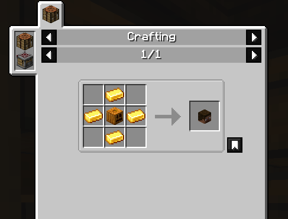
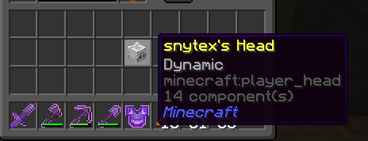

# Craftable Player Heads

A datapack for Minecraft 26.1.2 that lets you craft the head of any player's skin. No mods needed.

## How it works

Craft a Player Head using a carved pumpkin in the middle with gold ingots on the four sides:



Then pop that head into an anvil and rename it to someone's username (like `Notch`). When you take it back out, it turns into that player's head with their actual skin. The head is dynamic too, so if that player ever changes their skin, the head updates on its own.



The first time you craft the recipe you'll get a quick chat message reminding you what to do next.

## Install

For a single-player world, drop the `CraftablePlayerHeads` folder (or the zip) into:

```
.../saves/<YourWorld>/datapacks/
```

For a server, put it in `<world>/datapacks/`.

Either way, run `/reload` in-game afterwards (or just reopen the world). You can double check it loaded with `/datapack list`, where it should show up as enabled with no red errors.

## Things worth knowing

* It fetches skins from Mojang, so you need an internet connection. Works in single-player and on online-mode servers. On an offline-mode server (or with no internet) the head just stays as Steve.
* Only real, current usernames work, and they max out at 16 characters. Type a name nobody owns and it stays Steve.
* Rename one head at a time. Don't try to convert a whole stack in a single anvil action.
* Your existing player heads are safe. The pack only touches a freshly crafted head that you've renamed, never a head that already has a skin.

## Tweaking it

* Recipe and cost live in `data/playerheads/recipe/head_mold.json`.
* The welcome message is in `data/playerheads/function/welcome.mcfunction`.

## Under the hood

No tick loops, it's all event driven:

* `advancement/instructions.json` fires once when you craft the recipe and prints the welcome tip.
* `advancement/renamed.json` fires whenever a player head shows up in your inventory (like when you pull the renamed one out of the anvil) and runs `function/convert`.
* `convert` re-arms the advancement, then only bothers scanning if a head with a custom name but no profile actually exists. That combination is the unique fingerprint of a renamed blank head, since real skinned heads always carry a profile. From there `scan` > `slot` > `read` > `build` find that head and use a function macro to swap it for `minecraft:player_head[minecraft:profile={name:"<username>"}]`, which pulls the real skin.
